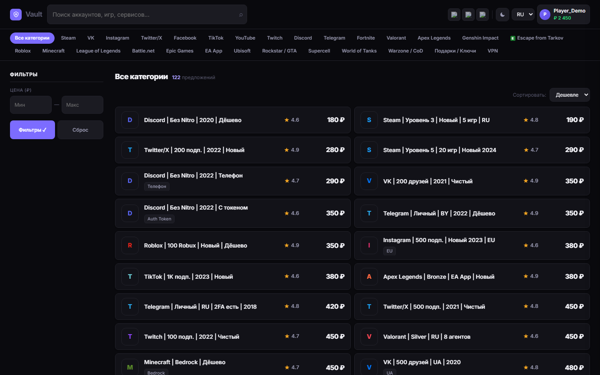
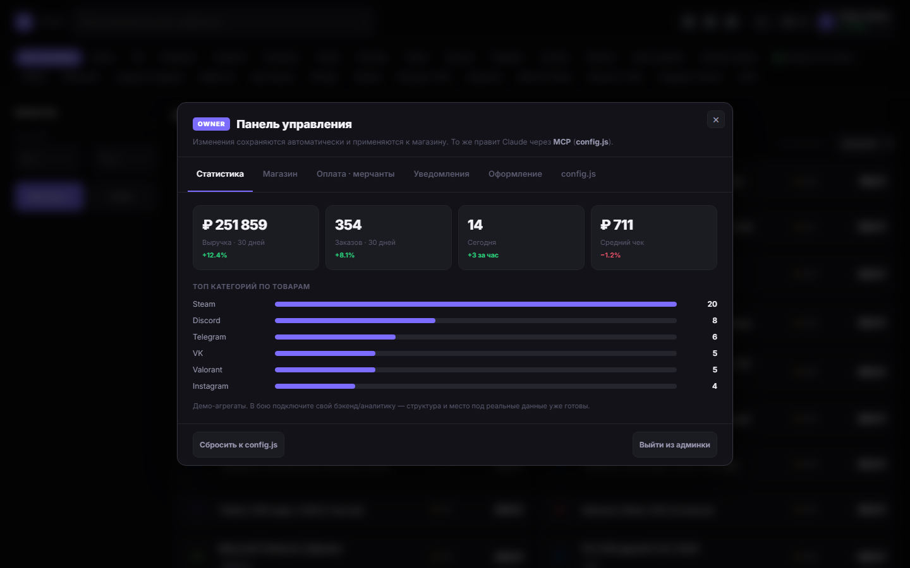
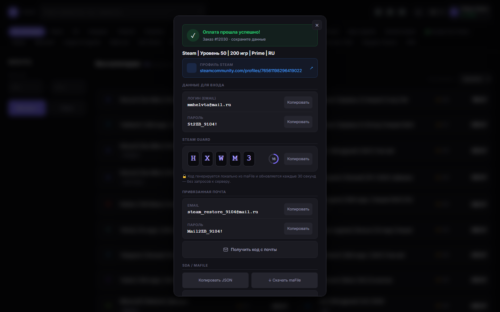

<p align="center">
  
</p>

# lzt-reseller

Витрина для перепродажи аккаунтов с [LZT Market](https://lzt.market). Каталог, админ-панель владельца и бэкенд, который проксирует API маркета (токен остаётся на сервере). Настраивается правкой `web/config.js` и `.env` — вручную или нейросетью по MCP, без правки кода.

Бэкенд на Node без зависимостей. Запуск — одна команда. Деплой на Ubuntu с доменом и HTTPS — тоже.

## Возможности

- Каталог: 29 категорий, фильтры по параметрам как в маркете, поиск, сортировка.
- Аккаунт-вьюер после покупки: Steam Guard (TOTP считается локально), maFile, коды с почты по запросу, токены, cookie.
- Админ-панель только для владельца (вход по паролю): статистика, мерчанты, Telegram-уведомления, оформление вживую, экспорт конфига.
- Тема и бренд меняются полностью через токены: палитра, логотип, шрифты, плотность, скругления. 7 пресетов + светлая/тёмная.
- Языки RU/EN, адаптив.
- Бэкенд: прокси LZT с серверным токеном, серверная авторизация владельца (подписанная сессия), Telegram, кэш, rate-limit.

## Скриншоты

| Каталог | Админ-панель | Выдача аккаунта |
|---|---|---|
|  |  |  |

## Быстрый старт (локально)

Нужен Node.js ≥ 18 (бэкенд без зависимостей, `npm install` не требуется).

```bash
git clone https://github.com/marketmcp/lzt-reseller.git
cd lzt-reseller
cp .env.example .env        # вписать OWNER_PASSWORD и SESSION_SECRET
npm start                   # http://localhost:3000
```

- Магазин: `http://localhost:3000`
- Админка (владелец): `http://localhost:3000/#admin`

Без `LZT_TOKEN` работает демо-режим на встроенных данных. Можно открыть `web/index.html` напрямую — витрина работает и как статика.

## Деплой на сервер + домен

Ubuntu-сервер, домен указан A-записью на его IP. Одна команда на сервере ставит Node, Caddy (авто-HTTPS) и systemd-сервис:

```bash
curl -fsSL https://raw.githubusercontent.com/marketmcp/lzt-reseller/main/deploy/server-setup.sh | sudo bash -s -- shop.example.com
```

Дальше вписать `OWNER_PASSWORD` и `LZT_TOKEN` в `/opt/lzt-reseller/.env` и `systemctl restart lzt-reseller`. Обновления — `sudo bash /opt/lzt-reseller/deploy/update.sh`. Подробно, плюс Docker — [docs/DEPLOY.md](docs/DEPLOY.md).

## Настройка

- Бренд, тема, категории, наценка, способы оплаты — [`web/config.js`](web/config.js) или админка `/#admin` (одно и то же, сохраняется и переживает перезагрузку).
- Секреты — `.env` ([`.env.example`](.env.example)).
- Через MCP: откройте репозиторий в любом AI-ассистенте и опишите задачу словами — он правит `config.js`/`.env`. Карта всех настроек — [AGENTS.md](AGENTS.md). Справочник — [docs/CONFIG.md](docs/CONFIG.md).

Примеры запросов к нейросети:

```
Назови магазин CyberShop, тема ocean, акцент #00e0b0, оставь Steam, Discord и Fortnite, наценка 20%
Подключи мой LZT-токен и Telegram-бота для уведомлений о заказах
Разверни на сервер shop.example.com
```

## Подключение реального LZT Market

1. Токен (scope `market`) из ЛК LZT → в `.env`: `LZT_TOKEN=...`
2. Перезапуск — бэкенд проксирует LZT через `/api/lzt/*`, токен остаётся на сервере.
3. Живой каталог: `LZT.goLive({ categories:['steam','discord'], currency:'rub' })`

Эндпоинты ([`web/lzt-api.js`](web/lzt-api.js)) сверены с офиц. докой: `GET /{category}`, `/category/{name}/params`, `POST /{id}/fast-buy`, `GET /{id}/mafile`, `GET /{id}/letters`. Учтены лимиты (120/мин общий, 20/мин на поиск) и серверный кэш.

## Безопасность

- Токен LZT только на сервере (`.env`), в браузер не уходит — всё через прокси.
- Вход владельца: серверная сессия (HMAC httpOnly-cookie), timing-safe сравнение, анти-брутфорс.
- `fast-buy`/`mafile`/`letters` — только владелец. Rate-limit, защита от path traversal, security-заголовки.
- Секреты в git не попадают (`.env` в `.gitignore`).

Чеклист перед публикацией — [docs/SECURITY.md](docs/SECURITY.md).

## Структура

```
web/        фронтенд: index.html (витрина + админка), config.js (настройка), lzt-api.js, assets/
server/     бэкенд: index.js — прокси LZT, авторизация, Telegram, статика (0 зависимостей)
deploy/     server-setup.sh, update.sh, systemd-юнит, Caddyfile
docs/       SECURITY · DEPLOY · CONFIG
AGENTS.md   карта настроек для AI (MCP)
```

## Статус

Готово: витрина, дизайн-система, админка с серверной авторизацией и персистентностью, прокси LZT, Telegram, деплой одной командой.

Демо (требует вашей интеграции под прод): товары на сид-данных без `LZT_TOKEN`; аккаунты пользователей/баланс/история — клиентские (для полного e-commerce нужна БД + регистрация); приём денег — выбор метода готов, вебхуки мерчанта подключаются под провайдера.

## Лицензия

[MIT](LICENSE). Не аффилировано с LZT Market.
